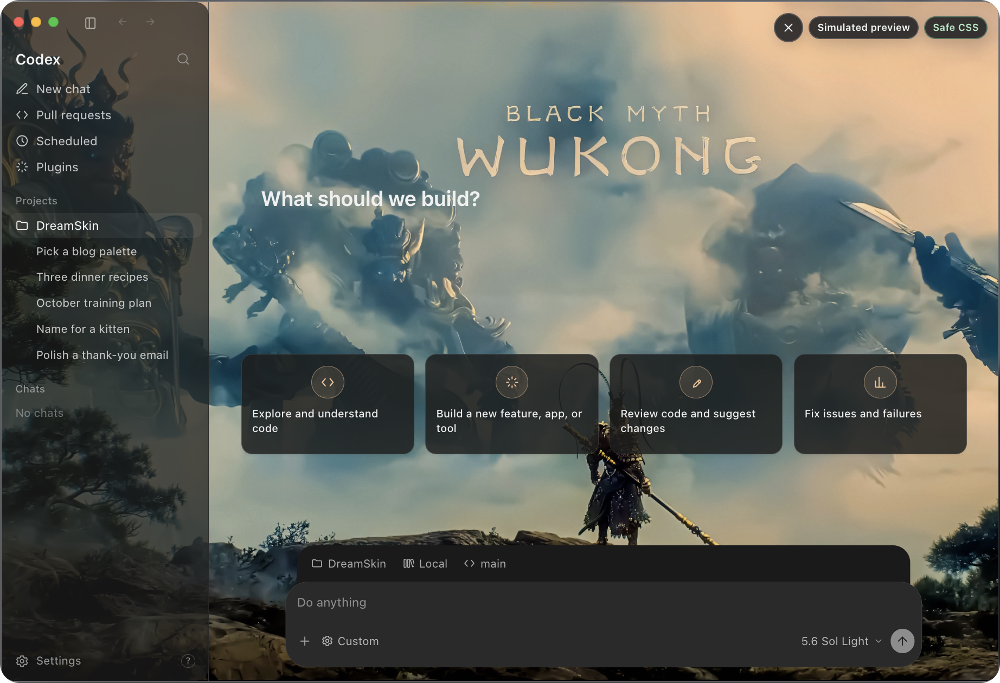
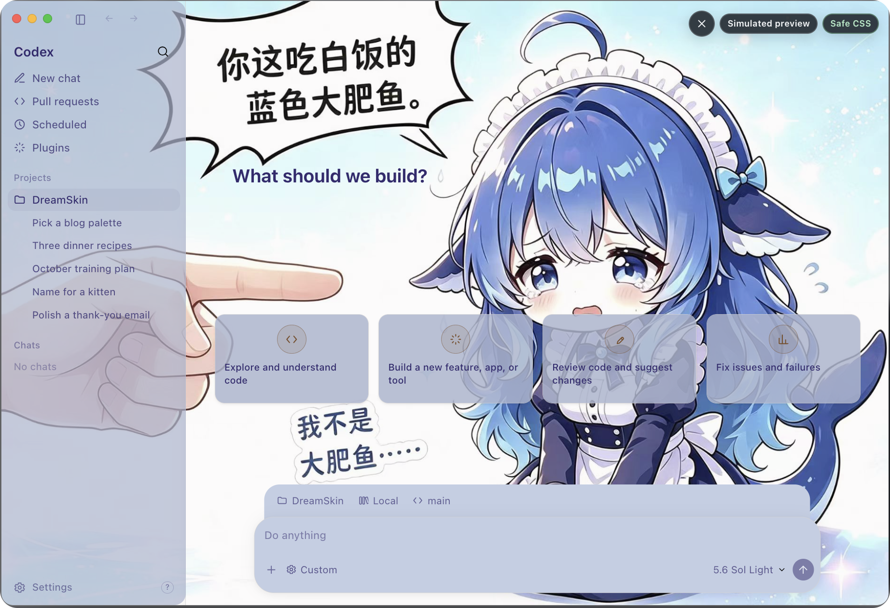
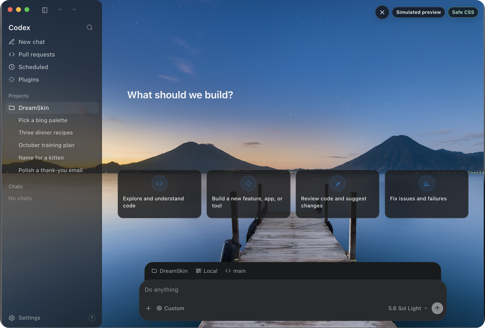

# Codex Dream Skin

  <a href="./README.md">中文</a> · <strong>English</strong>

  <strong>Give Codex a face that breathes.</strong> 
  External themes for the Codex desktop app · Local CDP inject · No official package mutation

  One image, one mood · Code with atmosphere

  Official theme library: <a href="https://dreamskin.cc"><strong>DreamSkin.cc</strong></a> ·
  <a href="https://dreamskin.cc/gallery">Gallery</a> ·
  <a href="https://dreamskin.cc/studio">Online Studio</a>

  Unofficial. Does not modify <code>.app</code> / <code>app.asar</code> / WindowsApps.

## 🤝 Exclusive sponsor

<table>
<tr>
<td width="180">

</td>
<td>
Thanks to Passion8 for being this project's exclusive sponsor! Passion8 is an AI API relay for developers, giving individuals and teams stable, low-cost access to mainstream large models.  
<strong>Full-power AI, within reach</strong>: the full OpenAI and Claude lineups, original models, no silent downgrades and no wrapper shells; frontier models for a fraction of official pricing, with top-ups at 1:1 — <strong>$1 = ¥1</strong>. Keep your official SDK and point the base URL at Passion8: Claude Code, Codex, Grok, and any OpenAI-compatible client just work — one line of config, no code changes.
<strong>Global edge acceleration</strong>: Cloudflare's global edge plus multi-route BBR acceleration for low latency and high availability; 7×24 relay, 99.9% SLA, sub-second TTFT target.
<strong>Secure by default</strong>: isolated API keys, encrypted key storage, and HTTPS end to end — privacy first.  
Passion8 has a benefit for this project's users: register through <a href="https://passion8.cc/sign-up?aff=ZgLT">this link</a> and your first top-up earns an automatic 10% bonus — no application needed, credited within 30 minutes. Questions go to <a href="mailto:support@passion8.cc">support@passion8.cc</a>.
</td>
</tr>
</table>

Theme install and API config stay separate — this project never rewrites your provider settings.

## Install directly

Ordinary users first install and quit the official Codex / ChatGPT app once,
then download from [GitHub Releases](https://github.com/YuxiangChai/Codex-Skin/releases):

- macOS: open `CodexDreamSkin-vX.Y.Z.dmg` and drag the app to Applications.

This personal release currently publishes macOS DMGs only. The Windows source
remains in the repository, but no public Setup.exe is built. No source
checkout, Node.js install, or `.sh` command is required. See the
[macOS guide](./docs/install-macos.md) for unsigned first-run approval, updates,
and uninstall steps.

## Theme library & community

  

  <strong>DreamSkin.cc</strong> · the official theme library and authoring platform 
  Make your workspace <em>yours.</em>

  <a href="https://dreamskin.cc/gallery"><strong>Browse the Gallery →</strong></a>
  &nbsp;·&nbsp;
  <a href="https://dreamskin.cc/studio"><strong>Online Studio →</strong></a>

- [**Gallery**](https://dreamskin.cc/gallery) — browse reviewed community themes
  with recent/popular sorting and creator rankings. Every theme can be tried on
  in an in-page desktop simulator before you install it.

<table align="center">
  <tr>
    <td align="center">
       
      悟空（WUKONG） by JamesOpsLab
    </td>
    <td align="center">
       
      DeepSeek-鲸鱼娘 by powerdog996
    </td>
  </tr>
</table>

- [**Online Studio**](https://dreamskin.cc/studio) — swap the background, tune
  theme colors, and write Safe CSS in the browser, then export a `.zip` pack or
  submit it to the library (sign-in required; published after human review).

  
   
  Online Studio · swap in a background you like, dial in the focal point and palette — now it's your theme

The macOS menu bar and Windows tray both link straight to **Gallery** and
**Online Studio**.

### One-click apply

Found a theme you like on DreamSkin.cc? **Apply** hands it to the local client
directly — no download-then-import step. Requires client v1.5.0 or newer
(v1.5.5+ recommended).

Flow and safety boundary:

- The page invokes the local app through `dreamskin://apply?version=ver_...`.
  The link can carry exactly one theme version ID — **never** an arbitrary URL,
  file path, or command — and there is no silent-apply parameter.
- The app fetches the package only from the fixed official API, and refuses
  redirects.
- A native confirmation appears first, and the app checks the version's review
  status, apply-compatibility flag, version, package size, actually downloaded
  byte count, and SHA-256.
- It then reuses exactly the same ZIP, manifest, image, and Safe CSS validation
  as a manual import.
- Success requires the real renderer to report the new theme as rendered. On a
  launch or render failure the app tries to restore the previous theme, and the
  restore is itself visibility-verified; if it cannot confirm either state it
  reports the status as unconfirmed rather than claiming a rollback.

Only themes that fully satisfy the current pack contract (background image +
`theme.json` + non-empty `theme.css` + declared `safe-css` capability) show the
one-click button. Anything else goes through the manual import below.

## Tested featured presets

### Iron Man

This personal release bundles exactly one theme. Its user-confirmed
redistributable AI-generated background uses a dark appearance, a main-content
focus that remains centered as the sidebar changes, one continuous canvas
shared with the sidebar, and a uniform `0.4` dim level.

   
  Redistributable wallpaper only; the runtime layers native Codex controls above it

After installation, switch to it from **Saved Themes** in the macOS menu bar or
Windows system tray.

## What it does

- **Real UI** — Sidebar, cards, project picker, and input stay native. Not a fake full-window screenshot.
- **Continuous wallpaper** — One 16:9 image spans the full window; adaptive focus, safe-area, and route treatment keep native content readable.
- **Swappable art** — Drop in a UI-free image you like and it becomes your theme.
- **Saved themes** — Switch local themes from the macOS menu bar or Windows system tray.
- **One-click apply** — Hit apply on [DreamSkin.cc](https://dreamskin.cc); the client verifies origin and checksum, then installs it.
- **Theme ZIP import** — Pick an ordinary `.zip` on either platform and add a validated pack to the local library.
- **Restorable** — One-click restore to the stock look.
- **Safer path** — Local-loopback CDP inject only. No official binary or signature changes.

## Quick start

### For users: download an installer

You do not need to clone the repository, install Node.js, or run `.sh` files.
Download the latest macOS package from
[GitHub Releases](https://github.com/YuxiangChai/Codex-Skin/releases), then
follow the graphical first-run guide:

| Platform | Download | Install guide |
|------|------|----------|
| macOS | `CodexDreamSkin-vX.Y.Z.dmg` | [`docs/install-macos.md`](./docs/install-macos.md) |

After installation, use the macOS menu bar. Updates download the new package
and install over the existing one; themes
and images are preserved. Because the public packages are unsigned, a new
download may show a one-time OS security warning; the guides explain the safe
GUI approval path.

### Import a downloaded theme

For themes from DreamSkin.cc, prefer [one-click apply](#one-click-apply). The
manual `.zip` path below is the fallback, and covers packs from any other source.

Choose **Import Theme ZIP…** from the macOS menu bar app or Windows tray. Only
ordinary `.zip` files are accepted; the legacy `.dreamskin` extension is not
supported, and renaming the suffix is not a supported migration path. An
official Studio pack contains `manifest.json`, `theme.json`, and exactly one
`background.webp|jpg|png`, plus non-empty `theme.css`; `LICENSE.txt` and the
reserved `manifest.sig`. Put these files at ZIP root or inside exactly one
top-level theme folder. The importer verifies platform and minimum-client
compatibility plus every declared payload file's byte length and SHA-256.
`theme.css` must pass the local Safe CSS validator and can affect only the 12
registered parts. It is revalidated on every import and apply. `manifest.sig`
is not used for signature verification.

The local simplified ZIP must contain exactly non-empty `theme.json`, non-empty
`theme.css`, and its referenced image. That format has no official
manifest integrity or compatibility declaration and should come from a trusted
source. Limits are 32 MiB per archive, 32 entries, and 64 MiB expanded. Import
adds the pack to **Saved Themes** without changing the active theme. Identical
content is not duplicated. A newer pack with the same ID updates the saved theme
in place after the old directory identity is confirmed, and only legacy `-2`/`-3`
directories with an identical semantic fingerprint are cleaned up. If the
existing directory identity cannot be confirmed, import fails closed instead of
overwriting it; names alone are never used to delete another theme.

For a manual fallback, extract the archive and move the complete directory
containing `theme.json`, `theme.css`, and its image into the saved-theme folder:

- macOS: `~/Library/Application Support/CodexDreamSkinStudio/themes/`
- Windows: `%LOCALAPPDATA%\CodexDreamSkin\themes\`

Both controls include **Open Themes Folder**. Reopen the menu/tray after moving
the directory. Do not add another wrapper level, links, nested archives, or an
image-only folder without `theme.json`. Manual placement bypasses the ZIP
importer's archive checks, so use trusted content only.

### For developers: run from source

Platform scripts are ready — different plumbing, same goal: theme Codex.

| Platform | Dir | Entry |
|------|------|------|
| Apple Silicon / Intel Mac | [`macos/`](./macos/) | Double-click `Install Codex Dream Skin.command` |
| Windows | [`windows/`](./windows/) | `scripts/install-dream-skin.ps1` → `start-dream-skin.ps1` |

More detail:

- Mac: [`macos/README.md`](./macos/README.md)
- Windows: [`windows/README.md`](./windows/README.en.md)
- Paths: [`docs/platforms.md`](./docs/platforms.md)
- Copy-ready reference prompt guide: [`docs/reference-background-prompt-guide.en.md`](./docs/reference-background-prompt-guide.en.md)
- Eight concept prompt breakdowns: [`docs/background-generation-prompts.md`](./docs/background-generation-prompts.md)
- Project notes: [`docs/PROJECT.md`](./docs/PROJECT.md)

## Feedback & contributions

- **Issues:** Use the [issue templates](./.github/ISSUE_TEMPLATE/) (bug / feature). Blank issues are disabled. Please try Verify / Restore self-checks before filing bugs.
- **PRs:** Follow the [PR template](./.github/pull_request_template.md) — describe the change and tick the self-checks you actually ran (e.g. `macos/tests/run-tests.sh`, verify / restore).

## Safety

- CDP binds `127.0.0.1` only — avoid untrusted local processes while the theme runs.
- Does not touch the official install directory or code signature.
- **Never** rewrites API Key / Base URL; relay and theme stay separate.

## License

- See [`macos/LICENSE`](./macos/LICENSE) (MIT) and [`macos/NOTICE.md`](./macos/NOTICE.md)
- Unofficial; Codex and related rights belong to their owners.
- People / IP material in bundled presets and previews is illustrative only — clear likeness, asset, and trademark rights before commercial redistribution.

---

Star it, pick a look, and make Codex yours for today.
