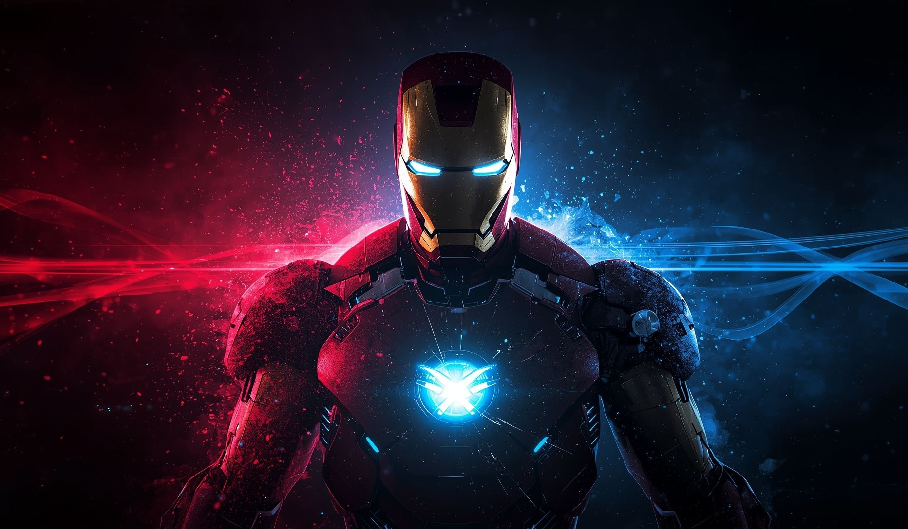

# Codex Skin

一个面向 macOS 的个人 Codex / ChatGPT 桌面主题引擎。

它保留官方应用的原生交互，只在运行时加入主题背景、首页布局和视觉样式；不会修改官方 `.app`、
`app.asar` 或代码签名。当前公开版本只发布 macOS 安装包，并默认内置一套 Iron Man 主题。

<p align="center">
  
</p>

## 这个版本有什么不同

### 1. 首页文字完全由主题控制

Chat、Work 和 Codex 三种首页使用同一套标题逻辑，不再各自显示不同的默认文案、字号和位置。
Iron Man 默认显示：

> Jarvis at your service

主题可以分别自定义首页标题、系统副标题、状态文字、项目提示和底部短句，例如：

```json
{
  "brandSubtitle": "JARVIS SYSTEM",
  "homeTitle": "Jarvis at your service",
  "tagline": "Jarvis online. Systems ready.",
  "projectPrefix": "Select project · ",
  "projectLabel": "◉  Select project",
  "statusText": "ARC REACTOR ONLINE",
  "quote": "I AM IRON MAN"
}
```

首页标题会在整个主窗口内垂直居中，不依赖某一种首页 DOM 结构。

### 2. 图片中心跟随对话区域

普通的全窗口背景会被左侧 Sidebar 挤偏：Sidebar 展开时，人物看起来不再位于聊天区域中央。
这个版本可以把图片焦点绑定到主对话区域，而不是整个窗口：

```json
{
  "art": {
    "focusX": 0.5,
    "focusY": 0.42,
    "scope": "main",
    "sidebar": "shared"
  }
}
```

- `scope: "main"`：图片中心以对话区域为基准。
- `sidebar: "shared"`：Sidebar 和对话区域仍使用同一张连续背景，不会拼成两张图。
- Sidebar 展开、收起或完全隐藏时，焦点会自动重新计算，人物始终留在可用主区域的中心。
- `focusX` / `focusY` 可以继续微调画面主体位置。

### 3. 明暗度属于主题

引擎不会替所有图片写死一套遮罩强度。每个主题可以用 `art.dim` 独立控制整张背景的暗度：

```json
{
  "art": {
    "dim": 0.5,
    "taskMode": "ambient"
  }
}
```

Iron Man 当前使用 `0.5`。同一层暗度会覆盖 Sidebar 和主区域，避免两边亮度不一致。

### 4. Codex 首页采用 Work 风格布局

- 输入框保持约 640 px 的紧凑宽度并固定在首页下方。
- Codex 与 ChatGPT Work 使用统一的圆角、间距和工具栏结构。
- 移除首页四个推荐卡片，让背景和输入框成为视觉主体。
- 清除额外品牌文字、输入框下方的原生渐变底色以及不必要的边框。
- 对话页仍保留原生消息、项目选择、模型选择、语音和权限控件。

### 5. 主题自己的 CSS

每个主题都可以包含 `theme.css`，只作用于引擎登记的公开部件，例如：

```css
[data-ds-part="composer"] {
  backdrop-filter: blur(16px);
  border-color: transparent;
}

[data-ds-part="sidebar"],
[data-ds-part="main"],
[data-ds-part="header"] {
  border-color: transparent;
}
```

导入和每次应用主题时都会重新检查 CSS；主题不能通过这里访问任意页面节点、加载网络资源或隐藏原生交互。

主题还可以单独设置用户消息的半透明底色：

```json
{
  "colors": {
    "accent": "#64e6ff",
    "userMessage": "rgba(100, 230, 255, 0.12)"
  }
}
```

未声明 `userMessage` 的旧主题会自动从自己的 `accent` 生成 12% 透明色；助手消息继续使用原生样式。

## Iron Man 主题

当前发行版只内置 Iron Man，主要配置位于：

- [`theme.json`](./macos/presets/preset-iron-man/theme.json)：文字、焦点、Sidebar、暗度和颜色。
- [`theme.css`](./macos/presets/preset-iron-man/theme.css)：输入框、边框和局部视觉细节。
- [`background.jpg`](./macos/presets/preset-iron-man/background.jpg)：背景图片。

如果只想换图，最简单的方法是从菜单栏选择换图功能。需要制作完整主题时，准备同一目录下的
`theme.json`、非空 `theme.css` 和一张由 `theme.json.image` 引用的图片，然后通过菜单导入普通 `.zip`。

## 安装

1. 先安装官方 Codex 或 ChatGPT 桌面应用，至少启动一次后退出。
2. 从 [GitHub Releases](https://github.com/YuxiangChai/Codex-Skin/releases) 下载最新 macOS DMG。
3. 打开 DMG，把里面的应用拖入“应用程序”。
4. 首次启动若被 macOS 拦截，进入“系统设置 → 隐私与安全性”，点击“仍要打开”。
5. 从菜单栏选择 Iron Man 并应用。

当前个人发行使用 ad-hoc 签名，不会要求关闭 Gatekeeper 或执行 `xattr`。首次安装和每次替换为新的
ad-hoc 构建时，macOS 仍可能要求确认一次。

更详细的图形界面步骤见 [macOS 安装说明](./docs/install-macos.md)。

## 更新与修复

从 `v1.5.9.3` 开始：

- “验证 / 修复本机引擎”会核对并重新部署当前 App 内置的同版本引擎，保留个人主题和图片。
- “检查更新”会显示发现的版本，确认后自动下载、校验、备份并替换应用。
- ad-hoc 更新完成后会自动打开“隐私与安全性”；用户只需批准新的 App。
- 新 App 无法确认启动时，更新助手会尝试恢复旧版。

`v1.5.9.1` 和 `v1.5.9.2` 的 ad-hoc 安装预检存在误判，需要手动安装
`v1.5.9.3` 一次；之后的版本才能使用修复后的自动更新链路。

个人版本采用 `上游版本.个人修订号`：

```text
1.5.9 < 1.5.9.1 < 1.5.10 < 1.5.10.1
```

这样既能继续合并上游的新功能，也不会占用上游下一次发布的版本号。

### 导入下载的主题

新版保留 DreamSkin.cc 一键换肤，也支持手动导入来自其他可信来源的 `.zip` 主题包。

在 macOS 菜单栏选择“导入主题 ZIP…”。只支持普通 `.zip`，
不支持 `.dreamskin` 后缀，也不要仅改后缀伪装。正式 Studio 主题包包含 `manifest.json`、
`theme.json`、非空 `theme.css` 和恰好一张 `background.webp|jpg|png`；还可包含 `LICENSE.txt` 和预留的
`manifest.sig`。这些文件可以位于 ZIP 根目录或唯一一层主题目录。导入器会核对适用平台、最低客户端
版本，以及清单中每个负载文件的大小和 SHA-256。`theme.css` 必须通过本机 Safe CSS 校验，导入后只会
作用于 12 个注册部件；每次切换/应用仍会重新校验。`manifest.sig` 当前不参与签名验证。

本地简化 ZIP 也必须恰好包含非空 `theme.json`、非空 `theme.css` 和其引用图片；该格式没有正式清单的
完整性与兼容性声明，只应从可信来源使用。压缩包最大 32 MiB、最多 32 个条目、解压后最多 64 MiB。
导入成功后主题只会加入“已保存的主题”，不会自动替换当前主题；相同内容不会重复写入。同 ID 的新版本会在
确认旧目录身份后原地更新，并仅清理语义指纹完全一致、已确认属于同一主题的旧版 `-2`/`-3` 重复目录；无法
确认身份时会拒绝覆盖，也不会根据名称猜测并删除其他主题。

也可以先手动解压，再把包含 `theme.json`、`theme.css` 和背景图的完整主题目录移动到本机主题库：

- macOS：`~/Library/Application Support/CodexDreamSkinStudio/themes/`

菜单里有“打开主题文件夹”快捷入口。移动后重新打开菜单/托盘即可；不要再套一层目录，也不要放链接、
嵌套压缩包或缺少三件套的文件夹。手动目录不会经过 ZIP 导入器的归档校验，请只使用可信内容。升级前
已经保存且没有 CSS 的 legacy 主题仍可切换，但不会注入额外 CSS。

### 开发者：从源码运行

macOS 源码入口：

| 平台 | 目录 | 入口 |
|------|------|------|
| Apple Silicon / Intel Mac | [`macos/`](./macos/) | 双击 `Install Codex Dream Skin.command` |

更细的说明：

- Mac：[`macos/README.md`](./macos/README.md)
- 路径对照：[`docs/platforms.md`](./docs/platforms.md)
- 可直接复制的参考生图模板：[`docs/reference-background-prompt-guide.md`](./docs/reference-background-prompt-guide.md)
- 八种概念方向详细提示词：[`docs/background-generation-prompts.md`](./docs/background-generation-prompts.md)
- 项目记录：[`docs/PROJECT.md`](./docs/PROJECT.md)

## 反馈与贡献

- **Issue：** 请用 [Issue 模板](./.github/ISSUE_TEMPLATE/)（Bug / 功能）；已关闭空白 Issue。提交前建议先跑 Verify / Restore 自检。
- **PR：** 请按 [PR 模板](./.github/pull_request_template.md) 写清改动，并勾选对应自测（如 `macos/tests/run-tests.sh`、verify / restore）。

## 安全边界

- CDP 只监听 `127.0.0.1`。
- 不修改官方应用安装目录、二进制文件或签名。
- 不改写 API Key、模型供应商或 Base URL。
- 主题图片、配置和运行状态保存在用户目录，覆盖安装不会删除它们。
- 这是非 OpenAI 官方项目；主题素材的再分发责任由使用者自行确认。

## Credit

本项目基于开源项目 [Codex Dream Skin](https://github.com/Fei-Away/Codex-Dream-Skin) 开发，感谢原作者与贡献者。

许可证见 [`macos/LICENSE`](./macos/LICENSE)。
